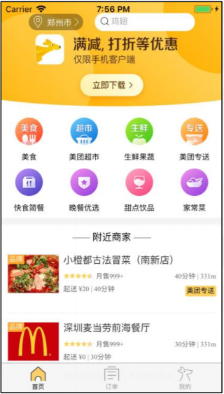
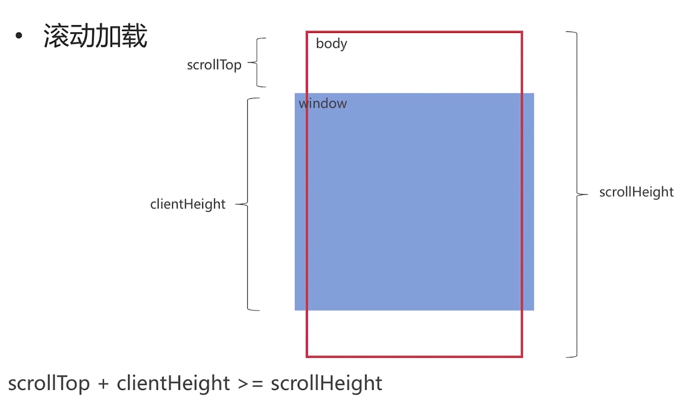

# 美团外卖项目

## 技术点

了解基本的css和JavaScript语法，了解jQuery的基础语法,使用rem对移动和web进行适配。

采用原生的JavaScript和jQuery来实现页面的交互。项目主要是针对前端。


## 本项目使用一个http-server的静态服务器

 http-server是一个简单的零配置命令行http服务器。它足够强大，足以用于生产用途，

但它既简单又易于破解，可用于测试，本地开发和学习。在这里我提供一个网址`https://www.npmjs.com/package/http-server`介绍了*http-server*的==安装==和==使用==

首页样式:



## 滚动加载页面




```
 function addEvent(){
        window.addEventListener('scroll',function(){
            //视窗的高度
            var clientHeight = document.documentElement.clientHeight;
            //可滚动的高度
            var scrollHeight = document.body.scrollHeight;
            var scrollTop = document.documentElement.scrollTop || document.body.scrollTop;

            var proDis = 30;
            if((scrollTop+clientHeight)>=(scrollHeight-proDis)){
                // 最多滚动加载三页
                if(page<3){
                    //在发送ajax请求时避免触发多次滚动加载
                    if(isLoading){
                        return;
                    }
                    getList();
                }else{
                    $('.loading').text('加载完成');
                }
                
            }
        })
    }
```


